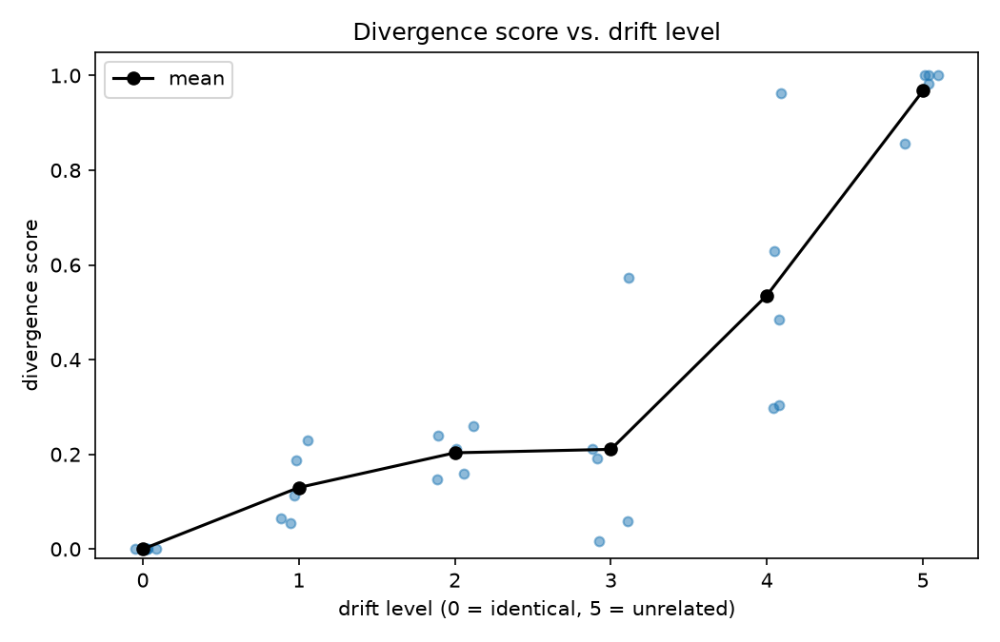
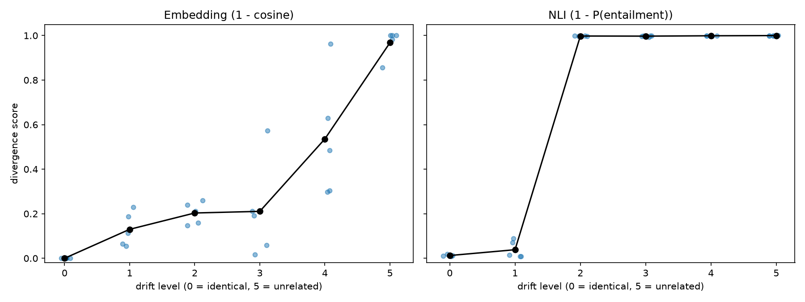
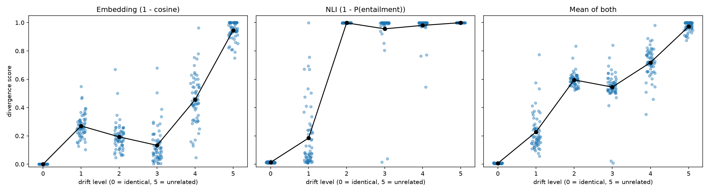

# my-tech-portfolio

## Does an AI's output still do what it was asked? Measuring intent drift

> Author: Park Seyoung
> Created: 2026-10-03 · Last updated: 2026-10-06

Small, reproducible experiments on one question: when an AI system's output
drifts away from the instruction it was given, can a cheap automatic score
detect it? I compare embedding similarity and an NLI model on a hand-built
360-pair test set, and record what worked, what didn't, and where the methods
fail (Experiments 1–4 below). All results come from synthetic data.


# Semantic Alignment & Intent Preservation


---

##  Research Hypothesis & Core Problem

- **The Problem:** LLMs perform probabilistic token prediction, which can lead to semantic drift and loss of original human intent between input instruction and internal representation.
- **The Goal:** Moving beyond black-box generation by measuring how much original meaning is preserved or lost across internal model states.

---

##  Research Architecture: Semantic Divergence & Information Flow

To analyze how human intent transforms and suffers from semantic loss during model processing, we propose a structural information-tracking pipeline:

```text
[ User Instruction (Original Intent) ] 
                 │
                 ▼
[ Tokenization & Embedding Space ]
                 │
                 ▼
[ Semantic Representation & Context Extraction ]
                 │
                 ▼
[ Divergence & Loss Measurement (Comparing Input vs. AI State) ]
                 │
                 ▼
[ Empirical Analysis: Tracking Semantic Drift ]

---

##  Experimental Design & Methodology (Planned)

To validate the semantic divergence hypothesis, we plan to implement a lightweight evaluation framework:

1. **Baseline Setup:** Use open-source embedding models to capture high-dimensional vector states of input prompts.
2. **Perturbation Tracking:** Introduce controlled variations (paraphrasing, ambiguity) into instructions to observe how internal representations shift.
3. **Similarity Metrics:** Apply cosine similarity and semantic distance algorithms between input vectors and intermediate hidden states to quantify "Semantic Drift".
4. **Visualization:** Plot divergence scores across processing steps to identify threshold points where intent loss sharply increases.

---

##  Repository Structure

- `README.md`: Research conceptualization, hypothesis, and structural architecture.
- `simulate_drift.py`: Prototype simulation script for measuring semantic divergence and intent drift.
- `evaluate_drift.py`: Scores a labeled test set and reports how the divergence score changes with drift level.
- `testset.csv`: Instruction pairs labeled with six drift levels (0 = identical, 5 = unrelated).
- `results/`: Scores and the divergence-by-level plot from the latest run.

##  Getting Started (Prototype)

To run the simulation script locally:

```bash
python simulate_drift.py
```

## Experiment 1: Does an embedding-based divergence score catch intent drift?

`testset.csv` pairs each original instruction with variants at six drift levels
(0 = identical, 1 = reworded, 2 = part dropped, 3 = condition flipped,
4 = related but different task, 5 = unrelated). `evaluate_drift.py` scores every
pair with `1 - cosine similarity` of sentence embeddings (all-MiniLM-L6-v2),
the same score used in `simulate_drift.py`.

Run: `python3 evaluate_drift.py`



| Level | Meaning | Mean score |
|---|---|---|
| 0 | identical | 0.00 |
| 1 | reworded | 0.13 |
| 2 | part dropped | 0.20 |
| 3 | condition flipped | 0.21 |
| 4 | different task | 0.54 |
| 5 | unrelated | 0.97 |

Spearman correlation between level and score: 0.884 (30 pairs, 5 per level).

**Finding:** the score separates unrelated tasks well, but it barely reacts to
flipped conditions. For example, "without changing the database schema" turned
into "by redesigning the database schema" scored 0.017. At a 0.3 threshold, 4 of
5 flipped-condition cases are missed. Embeddings measure topic similarity, not
whether a constraint was followed.

**Limitations:** only 30 pairs so far, so these numbers show direction, not a
final measurement. Next: a larger test set and a contradiction-aware scorer.


## Experiment 2: Does a contradiction-aware scorer catch what embeddings miss?


> **Update:** this is a preliminary run on 30 pairs. The 360-pair run in Experiment 3 found
> NLI false alarms on paraphrases and a few misses, so the "no overlap" result below did
> not hold at scale.

`evaluate_nli.py` adds a second scorer on the same 30 pairs: a natural-language-inference
model (`cross-encoder/nli-MiniLM2-L6-H768`) reads the new state and the original
instruction and returns P(entailment). The NLI score is `1 - P(entailment)`.

Run: `python3 evaluate_nli.py` (after `python3 evaluate_drift.py`)



Share of pairs flagged at threshold 0.3:

| Level | Meaning | Embedding | NLI |
|---|---|---|---|
| 0 | identical | 0% | 0% |
| 1 | reworded | 0% | 0% |
| 2 | part dropped | 0% | 100% |
| 3 | condition flipped | 20% | 100% |
| 4 | different task | 80% | 100% |
| 5 | unrelated | 100% | 100% |

Level 3 (condition flipped), score per pair:

| Variant | Embedding | NLI |
|---|---|---|
| "ignore the risks, summarize only the positive points" | 0.211 | 0.993 |
| accept the meeting instead of declining | 0.059 | 0.999 |
| "redesign the database schema" instead of leaving it unchanged | 0.017 | 0.999 |
| flight direction reversed, price limit removed | 0.192 | 0.996 |
| short summary changed to a detailed expert review | 0.573 | 0.999 |

**Findings:**
- NLI separates preserved instructions (levels 0-1) from violated ones (levels 2-5)
  with no overlap at any threshold from 0.3 to 0.9, and it catches all five flipped-condition
  cases that the embedding score mostly missed.
- NLI does not rank severity: levels 2 to 5 all score close to 1.0. Embeddings track
  severity but miss flipped constraints. The two scorers are complementary.
- One flipped case ("no price limit") was judged neutral rather than contradictory
  (P(contradiction) = 0.005), so `1 - P(entailment)` does not tell neutral from contradiction.

**Limitations:** 30 hand-written pairs (5 per level), and the level 1 paraphrases are
easy ones, so the 0% false-alarm rate is not yet established. Next: a larger test set
with harder paraphrases, multi-constraint instructions and longer text, and a combined
score that uses both scorers.


## Experiment 3: 360 pairs, harder paraphrases, typed constraint violations

`testset_v2.csv` has 60 instructions with six variants each (levels 0-5, 360 pairs).
Level 1 paraphrases share few words with the original. Level 3 (a constraint is
violated) is split by kind: `negation`, `number`, `entity` (who/what/direction) and
`scope`. The test sentences were drafted with Claude's help.

Run:

```bash
python3 evaluate_drift.py testset_v2.csv results_v2
python3 evaluate_nli.py testset_v2.csv results_v2
```



Share of pairs flagged (embedding score > 0.3, NLI score > 0.5; thresholds were set
before running this test set and not tuned on it). Identical and paraphrase rows
should be near 0%, all others near 100%.

| Kind | Pairs | Embedding | NLI |
|---|---|---|---|
| identical | 60 | 0% | 0% |
| paraphrase | 60 | 30% | 12% |
| part dropped | 60 | 7% | 100% |
| flipped: negation | 15 | 0% | 100% |
| flipped: number | 16 | 0% | 100% |
| flipped: scope | 13 | 0% | 100% |
| flipped: entity | 16 | 25% | 88% |
| different task | 60 | 85% | 100% |
| unrelated | 60 | 100% | 100% |

**Findings:**
- The embedding score flags none of the 44 pairs where a negation, number or scope
  constraint was flipped (mean score 0.08-0.13), while it flags 30% of harmless
  paraphrases (mean score 0.27). Changing the threshold does not fix this: at 0.2 it
  flags 82% of paraphrases but only 22% of the 60 level-3 pairs.
- NLI flags 238 of the 240 pairs at levels 2-5 and 7 of 60 paraphrases (12%).
  Most of those 7 look like valid paraphrases on inspection
  (e.g. "Convert the instruction booklet from English to Korean").
- Both NLI misses are direction reversals with the same words in swapped roles
  (Berlin to Seoul vs. Seoul to Berlin; English to Korean vs. Korean to English).
  With only 2 cases this is a lead, not a conclusion.
- Flagging a pair when either scorer fires raises false alarms on paraphrases to 37%,
  so the two scores should not simply be OR-ed.

**Limitations:** one author, hand-written pairs, one small NLI model
(`cross-encoder/nli-MiniLM2-L6-H768`), one embedding model, and no independent check of
the labels yet. Next: use NLI to decide whether a constraint was violated and embeddings
only to rank severity, add direction-reversal cases on purpose, and try a larger NLI model.


### Experiment 4 — Does the NLI scoring rule matter?

**Question.** Experiment 3 flagged ~12% of harmless paraphrases. Can a different
way of turning NLI probabilities into a drift score reduce that without losing
real violations?

**Setup.** Same 360-pair testset_v2, same NLI model. Three scoring rules:
A = 1 − P(entailment), B = P(contradiction) only,
C = 1 − min(P(entail) forward, P(entail) reverse).
Harmless = identical + paraphrase (n=120); violations = negation, number,
entity, scope (n=60). Alert threshold fixed at 0.5 (0.3 and 0.7 also reported).

| Rule | AUC | False alarm @0.5 (paraphrase, n=60) | Detected @0.5 (violations, n=60) |
|------|-----|------|------|
| A    | 0.982 | 12% | 97% |
| B    | 0.983 | 3%  | 95% |
| C    | 0.978 | 28% | 97% |

**Findings.**
1. Ranking quality is the same for all three rules (AUC ≈ 0.98). The rules only
   move the operating point.
2. B (contradiction only) had fewer false alarms on paraphrases (12% → 3%)
   and kept 95% of the four violation kinds above. However, those four kinds
   all change the meaning of a statement. When B was checked on the other
   three kinds in the test set, it missed most of them (see table below). The
   low false-alarm rate came from ignoring drift that is not a contradiction.
3. Adding the reverse direction (C) made it worse: false alarms rose to 28%.
4. All three rules missed the same 2 of 16 entity cases. Both are direction
   swaps with identical words (Seoul→Berlin vs Berlin→Seoul; English→Korean vs
   Korean→English), scored 0.01–0.04. This suggests the NLI model treats high
   word overlap as agreement when only the order flips. Based on two examples;
   not tested further.

**Added after the first run: the other three kinds** (share flagged at 0.5, n=60 each)

| Kind | A | B | C |
|------|---|---|---|
| different_task | 100% | 65% | 100% |
| part_dropped | 100% | 0% | 100% |
| unrelated | 100% | 90% | 100% |

**Conclusion.** On this data A is the safer default. B is only suitable if
contradictions are the only concern. A rule that keeps A's coverage while
cutting its paraphrase false alarms (12%) was not found here.

**Limitations.** Hand-built synthetic data; 13–16 rows per meaning-changing
violation kind; one NLI model. Results show what happened on this test set, not
how it would do on real agent output.
